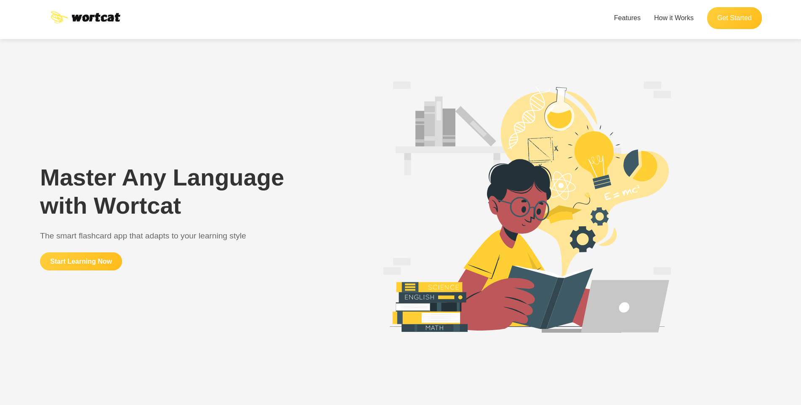
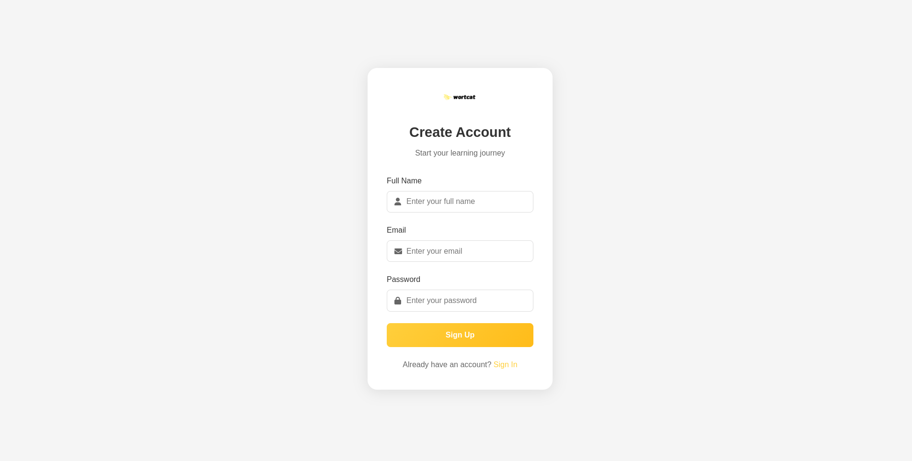
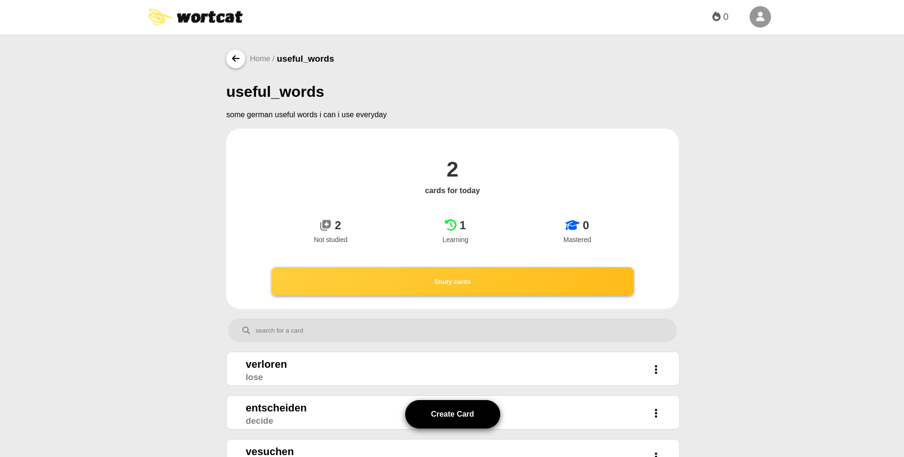
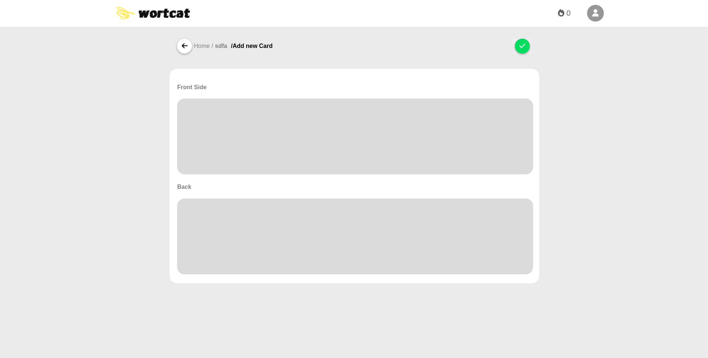
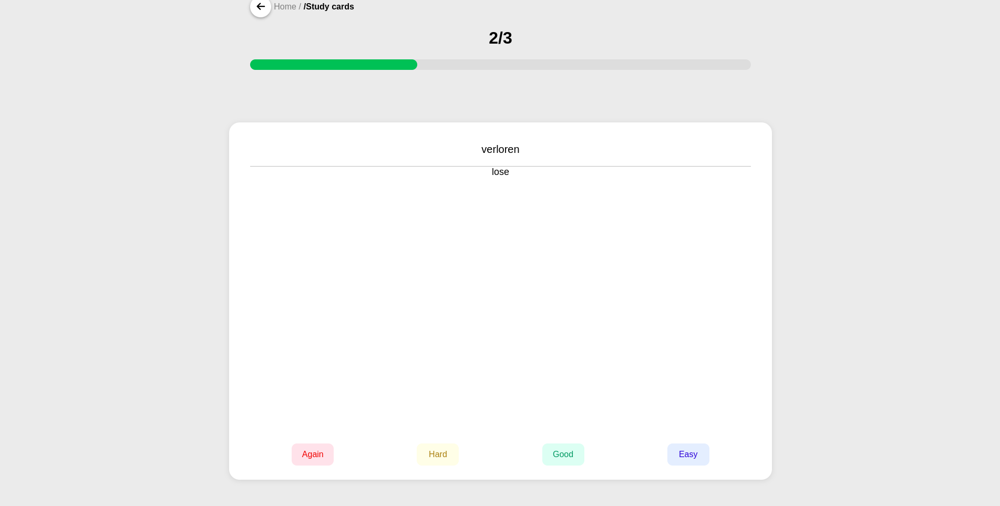
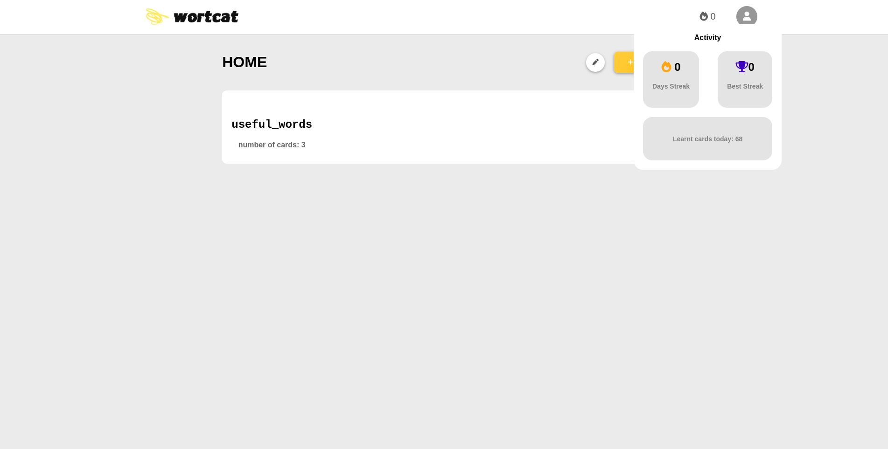

# Wortcat - Vocabulary Learning Web App

A web-based vocabulary learning application built with vanilla JavaScript, HTML, and CSS. It connects to the [Wortcat API](https://github.com/AlaSww/wortcat-api) backend for authentication, spaced repetition, and user data management.

---

## 🚀 Features

- **Modern UI** – Clean and responsive interface
- **Deck Management** – Create and organize vocabulary decks
- **Card System** – Add vocabulary cards with terms and definitions
- **Learning Statistics** – Track your progress over time
- **Spaced Repetition** – Optimized review schedule (SM2 algorithm)
- **Secure Authentication** – JWT-based login system

---

## 🖼️ Screenshots

| Landing Page | Registration | Deck View |
|--------------|--------------|-----------|
|  |  |  |

| Card Creation | Study Mode | Home Dashboard |
|---------------|------------|----------------|
|  |  |  |

---

## 🧰 Tech Stack

**Frontend:**
- Vanilla JavaScript
- HTML5
- CSS3

**Backend API:**
- [Wortcat API](https://github.com/AlaSww/wortcat-api)
  - Spring Boot
  - PostgreSQL
  - JWT Authentication

---

## 📚 Usage

1. Register a new account or log in
2. Create decks to organize your vocabulary
3. Add cards with terms and definitions
4. Study with spaced repetition
5. Track your stats on the dashboard

---

## 🔗 API Integration

All API communication is handled via the [Wortcat API](https://github.com/AlaSww/wortcat-api). Features include:

- JWT-based Authentication and Authorization
- SM2 Spaced Repetition Algorithm
- Vocabulary Card and Deck Management
- Learning Statistics

---

## 🛠️ Development

To make changes:

- Edit HTML files in `src/docs/`
- Update JavaScript logic in `src/js/`
- Modify styles in `src/css/`
- Open the relevant `.html` file in your browser to test

---

## 📬 Contact

**Ala S.**  
GitHub: [github.com/AlaSww](https://github.com/AlaSww)  
Email: alaeddinebensalem01@gmail.com